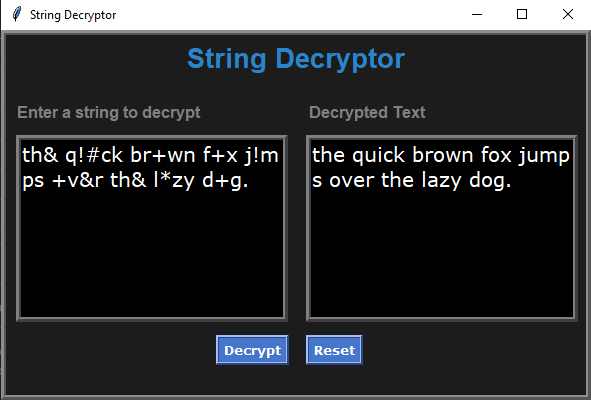

# Decryption of Strings

This repository has a GUI for string decryptor that will accept a string as encrypted text and then the program will decrypt it using the following character substitute:

'a' = *, 'e' = & , 'i' = # , 'o' = + 'u' = !

**See sample demo:**



## Documentation

Some basic info about the methods defined in the Decryptor and Interface class

```
class Decryptor(builtins.object)
 |  #define a class to decrypt string
 |
 |  Methods defined here:
 |
 |  decrypt(self)
 |      Prompts the user for an encrypted string then replaces the sumbols
 |      to their corresponding letters to generate the decrypted string.
 ```

 ```
class Interface(builtins.object)
 |  #build a GUI for the Decryptor
 |  __init__(self)
 |      Initializes the interface window and runs the main loop.
 |
 |  decrypt(self)
 |      Retrieve the text from the input box, strip any leading/trailing
 |      whitespace, and pass it to the Decryptor instance to get the decrypted
 |      string. Then, clear the output box to insert the decrypted string.
 |
 |  reset(self)
 |      Clears the contents of input and output on its text boxes.
 ```
